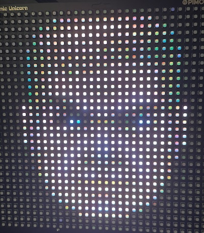

# cosmic-doom-guy

Doom Guy, on your Pimoroni Cosmic Unicorn
https://shop.pimoroni.com/products/cosmic-unicorn

#

## Upload the files to your pico

Create the folder "doom-guy" to hold the image file
Upload doom-guy.jpg to the "doom-guy" folder.
Upload doom.guy.py to the root of your pico.

## Run the file

Run doom-guy.py with Thonny

## Optionally make this script run when the Pico boots up

If you want this script to run on boot, then you need to copy the contents of `doom-guy.py` into `main.py`. main.py is the file that starts on boot.

## How to change Doom Guys mood

Press the A, B, C, or D buttons to change Doom Guy's mood
- A: Happy
- B: Upset
- C: Angry
- D: Bloody

#

Thanks to Pimoroni for creating these awesome boards!

2024 Chris Carey